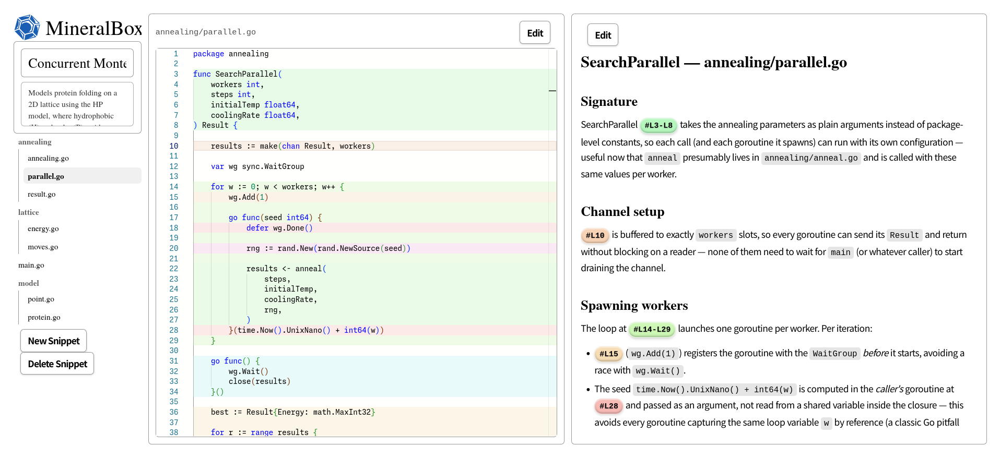

# mineralbox

## Introduction 

- このアプリは、ソフトウェア開発技能を効率的に習得することを目的としたスニペットマネージャです。
- このアプリは、SPA＋CSRの個人向けのアプリです。
- バックエンドはGo+PocketBase **v0.39+**、frontendは、solid.js + **tailwind v4**で書かれています。

## Design
- このアプリでもっとも重要なエンティティは、Specimenです。Specimenの構成要素としてSnippetがあり、Specimenの分類方法にBoxとTagがあります。
- Snippetは、Box/Specimen/Snippetという階層構造で整理されています。Snippetは必ずSpecimenの一部であり、あるSpecimenは必ずあるBoxに所属します。
- Githubで例えるとBoxがuserでSpecimenがリポジトリに相当します。Snippetはあるリポジトリの中のファイルに相当します。

### ルート設計
- /: ~~boxの一覧+とあるboxの中のspecimenの一覧をカードで表示~~ すべてのspecimenの一覧表示（暫定）
- /{box_name}: あるboxの中のspecimenの一覧をカードで表示
- /{box_name}/{specimen_id}: boxの中の特定のspecimenのルートを表示

### Tech Stack
- Go
- [SolidJS](https://github.com/solidjs/solid)
- [PocketBase](https://github.com/pocketbase/pocketbase)
- MonacoEditor

### Prior Art
- https://deepwiki.com/snibox/snibox
- https://deepwiki.com/MohamedElashri/snipo
- https://deepwiki.com/jordan-dalby/ByteStash

https://snipo.melashri.dev/