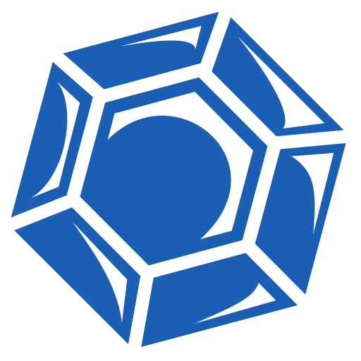

# mineralbox

## Introduction 

- このアプリは、ソフトウェア開発技能を効率的に習得することを目的としたスニペットマネージャです。
- このアプリは、SPA＋CSRの個人向けのアプリです。
- バックエンドはGo+PocketBase **v0.39+**、frontendは、solid.js + **tailwind v4**で書かれています。

## ルート設計
- /: すべてのboxの一覧をカードで表示（暫定）
- /{box_name}: あるboxの中のspecimenの一覧をカードで表示
- /{box_name}/{specimen_id}: boxの中の特定のspecimenのルートを表示

### Tech Stack
- Go
- [SolidJS](https://github.com/solidjs/solid)
- [PocketBase](https://github.com/pocketbase/pocketbase)

### Prior Art
- https://deepwiki.com/snibox/snibox
- https://deepwiki.com/MohamedElashri/snipo
- https://deepwiki.com/jordan-dalby/ByteStash